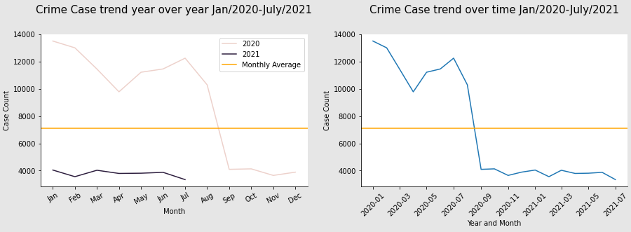
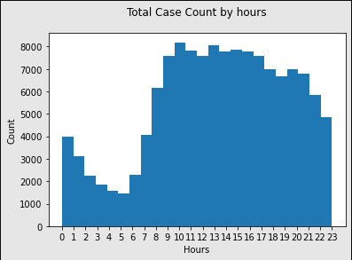
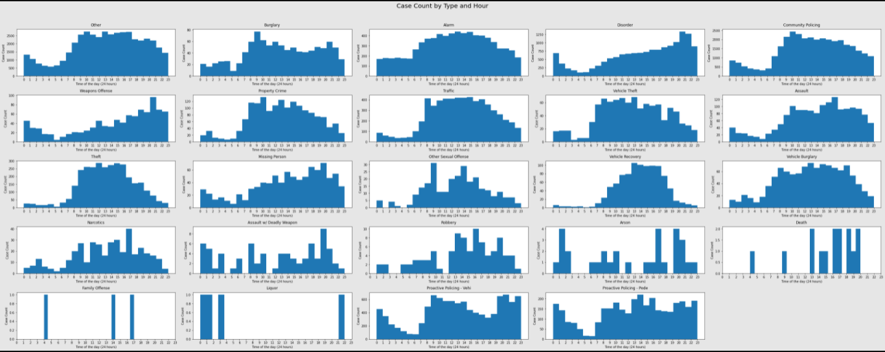

# Exploratory Data Analysis on Santa clara County Crime Reports
Goals:
1. Look at the trend of crime reports count since the beginning of 2020 till now
2. Build a model to predict crime reports count given the month, day and hour of the day

Structures: (1-4 are covered in the [jupyter notebook](https://github.com/ChantieSophia/scc-crime-reports/blob/3147cc224a9a593774fb7ed5d6618bae5ff1fed8/Santa%20Clara%20Crime%20Report.ipynb))
1. Get the datasource by calling the portal API
2. Explore the data and clean the data if necessary
3. Create plots
4. Build a model
5. Conclusions

  * Overall trend for the number of crime reports is going down since 2020.
  
  * Different type of crime reports have different distribution over the day. For total cases of all types, the number of crime reports goes up starts from 5-6 in the morning and flutuates a little and starts going down from 8-9 in the evening.
  
  
  * The regression model we built is 78% acurate. There is a lot room to improve the accuracy by introducing more variables, for instance, the type of the crime report, etc,, which we will cover in future project.

Laugange: Python
Tools: Pandas, Numpy, Matplotlib.pyplot, Seaborn, Socrata, Skitlearn

Data Source: [Source](https://data.sccgov.org/Public-Safety/Crime-Reports/n9u6-aijz). Last Updated at July 28, 2021
